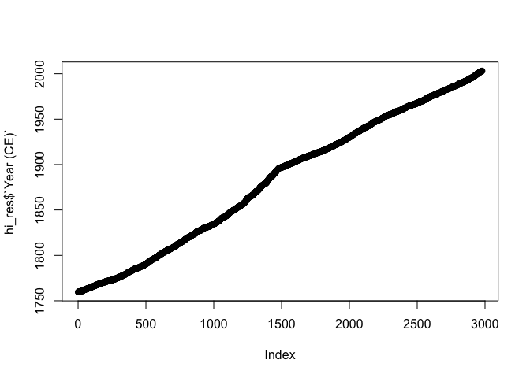

Coding Demo Day 2 - Following L.K. McDonough et al. 2022 Past fires and
post-fire impacts reconstructed \[from\] stalagmite - R Notebook
================

Following article “Past fires and post-fire impacts reconstructed from a
southwest Australian stalagmite” \~ L.K. McDonough et al. 2022.
(<https://doi-org.ezproxy.baylor.edu/10.1016/j.gca.2022.03.020>)

A note on coding style. I’m showcasing ‘high-level’ scripting here, not
in the quality sense, but in the development sense.For language like R,
Python and Matlab it is often more time (cpu cycles) and space (memory)
efficient to use vectorized or recursive operations than loops. It is
expected that the developers have worked this out. For that reason, my
M.O. in coding this was to find the best existing software and commands
to perform each step. As it turns out I didn’t need to use any basic
computer science operations like loops or conditional. For background on
syntax and optimizing strategies see
(<https://cran.r-project.org/doc/manuals/r-release/R-intro.html#Loops-and-conditional-execution>
;
<http://rstudio-pubs-static.s3.amazonaws.com/5526_83e42f97a07141e88b75f642dbae8b1b.html>),
and see the illustrative example “Benchmark - Fibonacci sequence” in
(<https://stackoverflow.com/questions/42393658/lapply-vs-for-loop-performance-r>).

Start by loading packages and importing data (excel downloaded from
<https://www.sciencedirect.com/science/article/abs/pii/S0016703722001454>),
which is also hosted on my github.

Method 1) Using Excel, save data as .csv. Remove everything except
column headers and data (\*Note). Read as with previous data, using
read\_csv Method 2) Showcased here. Tidyverse readexcel package is new
to us.

``` r
####written by W.J. Matthaeus 2022 for Montañez lab group coding tutorial

#the default working directory set by RStudio is the root directory
#(on OSX root is ~ for short, and probably C: in Windsows),
#set the working directory to the directory containing your code and input files
#for PC users this will look like "C:/path/to/files", 
#NOTE: the slashes are opposite direction
setwd("~/Dropbox/R_on_git/R_Speleothem")

#packages for:
#data input and manipulation
library(tidyverse)
```

    ## ── Attaching packages ─────────────────────────────────────── tidyverse 1.3.0 ──

    ## ✓ ggplot2 3.3.5     ✓ purrr   0.3.4
    ## ✓ tibble  3.1.6     ✓ dplyr   1.0.8
    ## ✓ tidyr   1.2.0     ✓ stringr 1.4.0
    ## ✓ readr   1.4.0     ✓ forcats 0.5.1

    ## Warning: package 'tidyr' was built under R version 4.0.5

    ## Warning: package 'dplyr' was built under R version 4.0.5

    ## ── Conflicts ────────────────────────────────────────── tidyverse_conflicts() ──
    ## x dplyr::filter() masks stats::filter()
    ## x dplyr::lag()    masks stats::lag()

``` r
library(tidymodels)
```

    ## Warning: package 'tidymodels' was built under R version 4.0.5

    ## ── Attaching packages ────────────────────────────────────── tidymodels 0.2.0 ──

    ## ✓ broom        0.8.0     ✓ rsample      0.1.1
    ## ✓ dials        0.1.1     ✓ tune         0.2.0
    ## ✓ infer        1.0.0     ✓ workflows    0.2.6
    ## ✓ modeldata    0.1.1     ✓ workflowsets 0.2.1
    ## ✓ parsnip      0.2.1     ✓ yardstick    0.0.9
    ## ✓ recipes      0.2.0

    ## Warning: package 'dials' was built under R version 4.0.5

    ## Warning: package 'parsnip' was built under R version 4.0.5

    ## Warning: package 'recipes' was built under R version 4.0.5

    ## Warning: package 'tune' was built under R version 4.0.5

    ## Warning: package 'workflows' was built under R version 4.0.5

    ## Warning: package 'workflowsets' was built under R version 4.0.5

    ## ── Conflicts ───────────────────────────────────────── tidymodels_conflicts() ──
    ## x scales::discard() masks purrr::discard()
    ## x dplyr::filter()   masks stats::filter()
    ## x recipes::fixed()  masks stringr::fixed()
    ## x dplyr::lag()      masks stats::lag()
    ## x yardstick::spec() masks readr::spec()
    ## x recipes::step()   masks stats::step()
    ## • Use tidymodels_prefer() to resolve common conflicts.

``` r
#install.packages("readxl")
library(readxl)
```

    ## Warning: package 'readxl' was built under R version 4.0.5

``` r
#EDA
# install.packages("corrplot")
library(corrplot)
```

    ## corrplot 0.92 loaded

``` r
#Time series analysis
# install.packages('zoo')
library(zoo)
```

    ## 
    ## Attaching package: 'zoo'

    ## The following objects are masked from 'package:base':
    ## 
    ##     as.Date, as.Date.numeric

``` r
#PCA
# install.packages("FactoMineR")
# install.packages("factoextra")
library(FactoMineR)
library(factoextra)
```

    ## Welcome! Want to learn more? See two factoextra-related books at https://goo.gl/ve3WBa

Import data and take a look. Always look at your variables to avoid
headaches later.

``` r
#import
hi_res <- read_excel(path = "1-s2.0-S0016703722001454-mmc1.xlsx",sheet =1 )
```

    ## New names:
    ## • `` -> `...17`

``` r
#take a look
hi_res
```

    ## # A tibble: 2,978 × 18
    ##    `DFT (mm)` `Year (CE)` `Organic matter (r…` `\u03b413C (\u…` `\u03b418O (\u…`
    ##         <dbl>       <dbl>                <dbl>            <dbl>            <dbl>
    ##  1       18.8       1760.                122.             -5.47            -2.79
    ##  2       18.8       1760.                116.             -5.49            -2.80
    ##  3       18.8       1760.                116.             -5.51            -2.81
    ##  4       18.8       1760.                116              -5.53            -2.82
    ##  5       18.8       1760.                116              -5.55            -2.83
    ##  6       18.8       1760.                115.             -5.57            -2.84
    ##  7       18.8       1760.                114.             -5.59            -2.85
    ##  8       18.8       1760.                110.             -5.61            -2.86
    ##  9       18.8       1760.                103.             -5.63            -2.87
    ## 10       18.8       1760.                 91.5            -5.65            -2.88
    ## # … with 2,968 more rows, and 13 more variables: `Mg (ppm)` <dbl>,
    ## #   `P (ppm)` <dbl>, `Sr (ppm)` <dbl>, `Ba (ppm)` <dbl>, `U (ppm)` <dbl>,
    ## #   `Al (ppm)` <dbl>, `Zn (ppm)` <dbl>, `Cu (ppm)` <dbl>, `Pb (ppm)` <dbl>,
    ## #   `S (relative greyscale concentration)` <dbl>,
    ## #   `Br (ppm) smoothed using 13 point Savitsky Golay filter` <dbl>,
    ## #   ...17 <lgl>,
    ## #   `*NOTE: This data is for the high resolution PCA. Data has been interpolated to the LA-ICP-MS data (0.0063mm resolution). The maximum and minimum DFT values for data utilised in the PCA are constrained by the maximum and minimum DFT values of the stable isotope data (0.05 - 18.85 mm DFT)*` <lgl>

So far looks good. Now for some QC.

``` r
#look at column names
colnames(hi_res) 
```

    ##  [1] "DFT (mm)"                                                                                                                                                                                                                                                                                        
    ##  [2] "Year (CE)"                                                                                                                                                                                                                                                                                       
    ##  [3] "Organic matter (relative greyscale concentration)"                                                                                                                                                                                                                                               
    ##  [4] "\u03b413C (\u2030)"                                                                                                                                                                                                                                                                              
    ##  [5] "\u03b418O (\u2030)"                                                                                                                                                                                                                                                                              
    ##  [6] "Mg (ppm)"                                                                                                                                                                                                                                                                                        
    ##  [7] "P (ppm)"                                                                                                                                                                                                                                                                                         
    ##  [8] "Sr (ppm)"                                                                                                                                                                                                                                                                                        
    ##  [9] "Ba (ppm)"                                                                                                                                                                                                                                                                                        
    ## [10] "U (ppm)"                                                                                                                                                                                                                                                                                         
    ## [11] "Al (ppm)"                                                                                                                                                                                                                                                                                        
    ## [12] "Zn (ppm)"                                                                                                                                                                                                                                                                                        
    ## [13] "Cu (ppm)"                                                                                                                                                                                                                                                                                        
    ## [14] "Pb (ppm)"                                                                                                                                                                                                                                                                                        
    ## [15] "S (relative greyscale concentration)"                                                                                                                                                                                                                                                            
    ## [16] "Br (ppm) smoothed using 13 point Savitsky Golay filter"                                                                                                                                                                                                                                          
    ## [17] "...17"                                                                                                                                                                                                                                                                                           
    ## [18] "*NOTE: This data is for the high resolution PCA. Data has been interpolated to the LA-ICP-MS data (0.0063mm resolution). The maximum and minimum DFT values for data utilised in the PCA are constrained by the maximum and minimum DFT values of the stable isotope data (0.05 - 18.85 mm DFT)*"

``` r
#drop 17 and 18, these are empty range in the excel table cause by the *NOTE entry
hi_res <- hi_res %>% select(-(c(17,18)))
#look at the column names
colnames(hi_res)
```

    ##  [1] "DFT (mm)"                                              
    ##  [2] "Year (CE)"                                             
    ##  [3] "Organic matter (relative greyscale concentration)"     
    ##  [4] "\u03b413C (\u2030)"                                    
    ##  [5] "\u03b418O (\u2030)"                                    
    ##  [6] "Mg (ppm)"                                              
    ##  [7] "P (ppm)"                                               
    ##  [8] "Sr (ppm)"                                              
    ##  [9] "Ba (ppm)"                                              
    ## [10] "U (ppm)"                                               
    ## [11] "Al (ppm)"                                              
    ## [12] "Zn (ppm)"                                              
    ## [13] "Cu (ppm)"                                              
    ## [14] "Pb (ppm)"                                              
    ## [15] "S (relative greyscale concentration)"                  
    ## [16] "Br (ppm) smoothed using 13 point Savitsky Golay filter"

``` r
#i don't like the way the deltas came in, change them
hi_res<-rename(hi_res, d18O="\u03b418O (\u2030)")
hi_res<-rename(hi_res, d13C="\u03b413C (\u2030)")
#these long names will wreak havoc later, change them
hi_res<-rename(hi_res, "Br (ppm)"="Br (ppm) smoothed using 13 point Savitsky Golay filter")
hi_res<-rename(hi_res, "OM (rgc)"="Organic matter (relative greyscale concentration)")
hi_res<-rename(hi_res, "S (rgc)"="S (relative greyscale concentration)")
colnames(hi_res)
```

    ##  [1] "DFT (mm)"  "Year (CE)" "OM (rgc)"  "d13C"      "d18O"      "Mg (ppm)" 
    ##  [7] "P (ppm)"   "Sr (ppm)"  "Ba (ppm)"  "U (ppm)"   "Al (ppm)"  "Zn (ppm)" 
    ## [13] "Cu (ppm)"  "Pb (ppm)"  "S (rgc)"   "Br (ppm)"

``` r
#better
```

Data structure (i.e., the tibble) is looking clean. Let’s do some EDA
(exploratory data analysis) I’m going to rearrange the data so it is
more convenient for plotting. I’ll use tidyr::pivot\_longer() to convert
to a ‘long’ format, wherein each row is a single observation (i.e., data
column), rather than a group of observations (several data columns) for
a single timepoint.

``` r
#you can print summar statistics for every column using
summary(hi_res)
```

    ##     DFT (mm)          Year (CE)       OM (rgc)            d13C       
    ##  Min.   : 0.05397   Min.   :1760   Min.   :  6.502   Min.   :-7.488  
    ##  1st Qu.: 4.75198   1st Qu.:1813   1st Qu.: 53.097   1st Qu.:-6.766  
    ##  Median : 9.44999   Median :1896   Median : 72.716   Median :-6.229  
    ##  Mean   : 9.44999   Mean   :1882   Mean   : 77.970   Mean   :-6.005  
    ##  3rd Qu.:14.14800   3rd Qu.:1950   3rd Qu.: 99.445   3rd Qu.:-5.439  
    ##  Max.   :18.84601   Max.   :2003   Max.   :187.890   Max.   :-2.329  
    ##       d18O           Mg (ppm)         P (ppm)            Sr (ppm)    
    ##  Min.   :-4.588   Min.   : 717.7   Min.   :  0.6999   Min.   :238.5  
    ##  1st Qu.:-3.691   1st Qu.:1245.7   1st Qu.:  2.2980   1st Qu.:319.7  
    ##  Median :-3.461   Median :1761.1   Median :  3.1171   Median :346.1  
    ##  Mean   :-3.378   Mean   :1845.6   Mean   :  4.3930   Mean   :345.4  
    ##  3rd Qu.:-3.100   3rd Qu.:2398.3   3rd Qu.:  4.8081   3rd Qu.:368.6  
    ##  Max.   :-1.941   Max.   :3870.8   Max.   :161.2020   Max.   :449.6  
    ##     Ba (ppm)         U (ppm)           Al (ppm)         Zn (ppm)      
    ##  Min.   : 6.276   Min.   :0.01721   Min.   : 1.997   Min.   :-0.4634  
    ##  1st Qu.: 8.830   1st Qu.:0.06743   1st Qu.: 5.561   1st Qu.: 0.7257  
    ##  Median :12.703   Median :0.08226   Median : 6.251   Median : 1.2161  
    ##  Mean   :12.711   Mean   :0.08511   Mean   : 6.525   Mean   : 1.5357  
    ##  3rd Qu.:15.872   3rd Qu.:0.10025   3rd Qu.: 7.095   3rd Qu.: 1.8764  
    ##  Max.   :22.741   Max.   :0.17588   Max.   :40.637   Max.   :18.5483  
    ##     Cu (ppm)           Pb (ppm)           S (rgc)          Br (ppm)    
    ##  Min.   :-0.08772   Min.   :-0.01838   Min.   : 62.00   Min.   :10.92  
    ##  1st Qu.: 0.03471   1st Qu.:-0.00138   1st Qu.: 98.89   1st Qu.:14.28  
    ##  Median : 0.06667   Median : 0.01394   Median :119.43   Median :15.60  
    ##  Mean   : 0.11565   Mean   : 0.29726   Mean   :127.18   Mean   :15.54  
    ##  3rd Qu.: 0.10224   3rd Qu.: 0.04446   3rd Qu.:147.30   3rd Qu.:16.79  
    ##  Max.   :16.32497   Max.   :78.13512   Max.   :249.52   Max.   :21.03

``` r
#drop columns not used in rolling average plot, and lengthen data
#this could also be done with a loop i.e., 
hi_res_long <-  hi_res %>% select(!c("Al (ppm)", "Pb (ppm)", "Cu (ppm)","Zn (ppm)"))%>%
  pivot_longer(!c("DFT (mm)","Year (CE)"),names_to = "Type",values_to = "Observation") %>% group_by(Type)

#take a look
hi_res_long
```

    ## # A tibble: 29,780 × 4
    ## # Groups:   Type [10]
    ##    `DFT (mm)` `Year (CE)` Type     Observation
    ##         <dbl>       <dbl> <chr>          <dbl>
    ##  1       18.8       1760. OM (rgc)    122.    
    ##  2       18.8       1760. d13C         -5.47  
    ##  3       18.8       1760. d18O         -2.79  
    ##  4       18.8       1760. Mg (ppm)   2507.    
    ##  5       18.8       1760. P (ppm)       3.05  
    ##  6       18.8       1760. Sr (ppm)    362.    
    ##  7       18.8       1760. Ba (ppm)     16.5   
    ##  8       18.8       1760. U (ppm)       0.0810
    ##  9       18.8       1760. S (rgc)     186.    
    ## 10       18.8       1760. Br (ppm)     17.7   
    ## # … with 29,770 more rows

``` r
#make the new Type variable a factor (categorical) variable, and tell R what the order should be
hi_res_long$Type <- factor(hi_res_long$Type, 
  levels = c("d13C","d18O",
 "Mg (ppm)","OM (rgc)",
  "P (ppm)","S (rgc)",                           
 "Sr (ppm)","Ba (ppm)",
  "U (ppm)","Br (ppm)"))

#histograms of all variables
ggplot(data = hi_res_long)+geom_histogram(aes(x=Observation))+facet_wrap(Type~.,scales = "free")
```

    ## `stat_bin()` using `bins = 30`. Pick better value with `binwidth`.

<!-- -->

``` r
#d18O and d13C scatterplot. nonequillibrium processes at play?
ggplot(data = hi_res)+geom_point(aes(x=d18O, y=d13C))+theme_minimal()
```

<!-- -->

``` r
#pairwise correlations?  stats::cor and corrplot::corrplot
hi_res_corr <- hi_res %>% select(!c("DFT (mm)","Year (CE)")) %>% cor()
corrplot(hi_res_corr, type = "lower", order = "hclust", 
         tl.col = "black", tl.srt = 45)
```

<!-- -->

``` r
#since we're doing time series analysis, lets also look at the time variable
#this is the base R plotting function, fine for single variables
#this line should be straight if the time series is regular (just a preliminary check)
plot(hi_res$`Year (CE)`)
```

<!-- -->

``` r
#for syntax reference
# plot(hi_res$`Year (CE)`, hi_res$`DFT (mm)`,xlim = rev(range(hi_res$`Year (CE)`)))
```

Now following article “Past fires and post-fire impacts reconstructed
from a southwest Australian stalagmite” \~ L.K. McDonough et al. 2022.
overlay raw data with 5-year moving average (100 timesteps)

I’ll check the time intervals for irregularity using
zoo::is.regular…they turn out to be irregular. I’ll use the rollmean
function from the zoo package, which is intended for use with irregular
time series to calculate the rolling mean separately for each data
column. This may not affect the outcome very much, but there’s no reason
not to use the best tool for the job. It’s a good idea to look into the
packages you use.
(<https://cran.r-project.org/web/packages/zoo/index.html>, doi:
10.18637/jss.v014.i06)

``` r
#alternatively, we could use stats from base R do define a filter to calculate moving average like this
# ma <- function(x, n = 100){stats::filter(x, base::rep(1 / n, n), sides = 2)}
#where n is the window size, rep 1/n produces an even weighting, and sides = 2 produces a centered rolling mean
#or we could use lapply
#the problem with this is that it is not robust to uneven time intervals

#directly check to see if the time series is strictly regular as proivded
is.regular(zoo(x=hi_res$d13C,order.by = hi_res$`Year (CE)`))
```

    ## [1] FALSE

``` r
#three nested functions to be applied groupwise below 
#read from inside out: store as zoo datatype, calculate rolling mean, then store as numeric vector
my_rollmean <- function(x, na.rm=FALSE)(as.numeric(rollmean(zoo(x,order.by = hi_res$`Year (CE)`), k=100, fill = NA)))

#calculate group means for each non-index column, then store like '_long' above
hi_res_means <- hi_res %>% mutate_at(vars(-'DFT (mm)', -'Year (CE)'), my_rollmean)%>%  #apply custom function
  select(!c("Al (ppm)", "Pb (ppm)", "Cu (ppm)","Zn (ppm)"))%>% #drop columns that the paper skips 
  pivot_longer(!c("DFT (mm)","Year (CE)"),names_to = "Type",values_to = "Observation") %>% #make observations long by Type
  group_by(Type) #tell R that the Type column is a partition of the observations

#i can define an ordering for the observation types so they plot in the same order as the paper
hi_res_means$Type <- factor(hi_res_means$Type, 
  levels = c("d13C","d18O",
 "Mg (ppm)","OM (rgc)",
  "P (ppm)","S (rgc)",                           
 "Sr (ppm)","Ba (ppm)",
  "U (ppm)","Br (ppm)"))

#build plot
p<-ggplot()+
  #new technique here, separate but same-shaped datasets being passed to data in separate geoms
    geom_line(data = hi_res_long,aes(x=`Year (CE)`, y=Observation, color = Type))+#lines for data, sometimes backticks `` must be used for non-standard variable names, in this case using regular tics '' or quotes "" would give ggplot one string ax your x
    geom_line(data = hi_res_means,aes(x=`Year (CE)`, y=Observation),color='black', linetype='dashed')+ #lines for rollmean
  #update formatting and break out by observation type
    theme_minimal()+facet_wrap(Type~.,scales = "free",ncol = 2)+ 
    theme(legend.position = 'none')

#view plot
p
```

    ## Warning: Removed 99 row(s) containing missing values (geom_path).

<!-- -->

``` r
#why the warning, how would we trace back the problem?
#try changing the fill value in  my_rollmean() to -999 and replotting
#is this really a problem?

#also not so good to look at, lets save and view separately
ggsave("raw_plus_rollmean_FireSpeleothem.png", plot = p, device = "png", 
       scale = 1, height = 8.5, width = 11, units = c("in"),
       dpi = 300, limitsize = TRUE)
```

    ## Warning: Removed 99 row(s) containing missing values (geom_path).

Compare this to Figure 3 from McDonough et al 2020.

Smooth transition to PCA. First we need to create a matrix of outcomes
without independent variables (x), then we can run the PCA.

(For some background, I recommend looking at
<https://towardsdatascience.com/a-one-stop-shop-for-principal-component-analysis-5582fb7e0a9c>).

The purpose of PCA is to take high-dimensional data (in this case 14
dimensions), find out what is contributing the most to the overall
variation in the dataset, and plot the variation in fewer dimensions. In
this case, we’re going to scale the obserations using the variance
(scale.unit=TRUE). This is good because we’re looking at a bunch of
observation types with different units (i.e., ppm & relative
concentration, that are not directly comparable), with very different
variances (e.g., Br and U). Try the code without scaling to see how it
affects the outcome.

``` r
#drop 'independent variables'
x<-subset(hi_res, select=-c(`DFT (mm)`,`Year (CE)`))
#perform PCA with scaling
unit<-PCA(X = x, scale.unit = TRUE)
```

<!-- --><!-- -->

``` r
#...without scaling
# var<-PCA(X = x, scale.unit = FALSE)

#check eigenvalues (importance of PCs)
unit$eig
```

    ##         eigenvalue percentage of variance cumulative percentage of variance
    ## comp 1  4.39731596             31.4093997                          31.40940
    ## comp 2  1.98458329             14.1755949                          45.58499
    ## comp 3  1.65982907             11.8559220                          57.44092
    ## comp 4  1.06377307              7.5983791                          65.03930
    ## comp 5  0.99962797              7.1401998                          72.17950
    ## comp 6  0.93386149              6.6704392                          78.84993
    ## comp 7  0.76361265              5.4543761                          84.30431
    ## comp 8  0.62818945              4.4870675                          88.79138
    ## comp 9  0.42121733              3.0086952                          91.80007
    ## comp 10 0.41039810              2.9314150                          94.73149
    ## comp 11 0.35334555              2.5238968                          97.25539
    ## comp 12 0.25465705              1.8189789                          99.07436
    ## comp 13 0.07276255              0.5197325                          99.59410
    ## comp 14 0.05682647              0.4059033                         100.00000

``` r
#plot individual datapoints in 'timeXPC space' 
plot(1:length(unit$ind$contrib[,1]),unit$ind$coord[,1],type = 'l', col='blue')
```

<!-- -->

``` r
plot(1:length(unit$ind$contrib[,2]),unit$ind$coord[,2],type = 'l', col='orange')
```

<!-- -->

``` r
plot(1:length(unit$ind$contrib[,3]),unit$ind$coord[,3],type = 'l', col='green')
```

<!-- -->

``` r
#biplot and cor plot are essentially the same. 
#rotated data in biplot with arrows showing correlation of variables and axes
#default biplot
fviz_pca_biplot(unit)
```

<!-- -->

``` r
#cor plot with just variables and unit cor circle
fviz_pca_var(unit,geom = c("point","text"))
```

<!-- -->

``` r
##cluster variables in pc space
#following paper
set.seed(162)
unit.kmeans<-kmeans(unit$var$coord, centers = 3, nstart = 25)
grps <- as.factor(unit.kmeans$cluster)
fviz_pca_var(unit,geom = c("point","text"),col.var = grps)
```

<!-- -->

``` r
#compare to eigenvectors (loadings of variables on PCs)
Eigenvectors_PC1and2<-as.data.frame(unit$svd$V[,1:2])
colnames(Eigenvectors_PC1and2)<-c("EV1","EV2")
rownames(Eigenvectors_PC1and2)<-colnames(x)
Eigenvectors_PC1and2
```

    ##                   EV1         EV2
    ## OM (rgc) -0.222967499 -0.03054869
    ## d13C      0.374653934  0.33053537
    ## d18O      0.353657382  0.31623067
    ## Mg (ppm)  0.387402024  0.22185525
    ## P (ppm)  -0.007243393  0.23229468
    ## Sr (ppm)  0.266955657 -0.43999789
    ## Ba (ppm)  0.428937177 -0.16454302
    ## U (ppm)   0.300392424 -0.33392659
    ## Al (ppm) -0.002366950  0.16819625
    ## Zn (ppm)  0.126064994  0.09494174
    ## Cu (ppm) -0.016692184  0.04790775
    ## Pb (ppm) -0.031940841  0.10549285
    ## S (rgc)   0.276827791 -0.47577779
    ## Br (ppm)  0.308860962  0.27813470

``` r
#... but with a whimper...
#.. no!
#bonus using high featured package
# unit.hcpc <- HCPC(unit, nb.clust = 3, graph = TRUE)
```

Compare the above to Fig 5 McDonough et al 2020.
