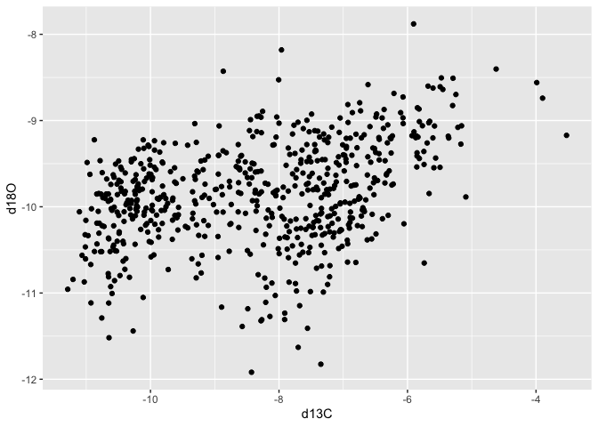
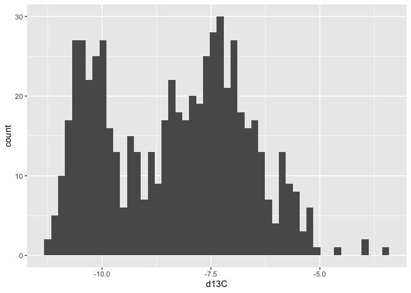
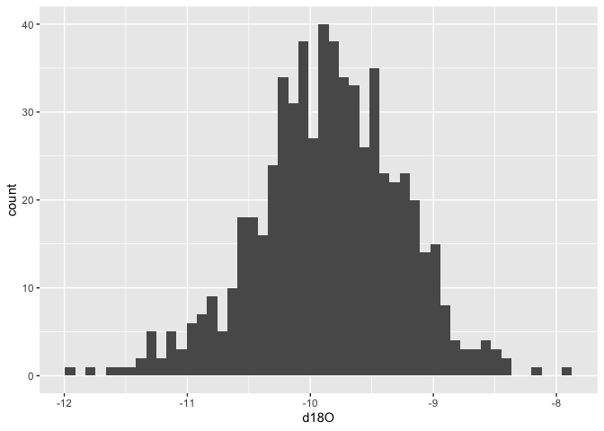
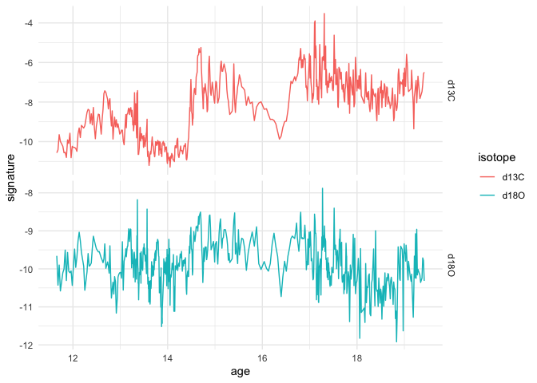
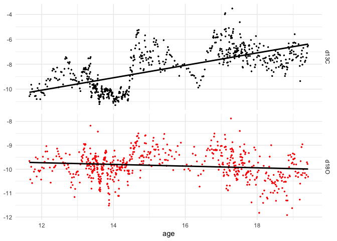
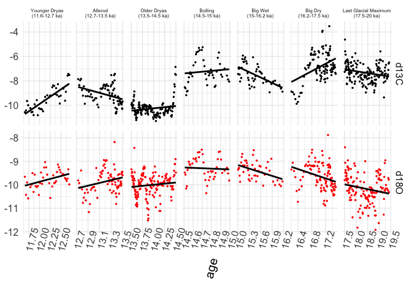
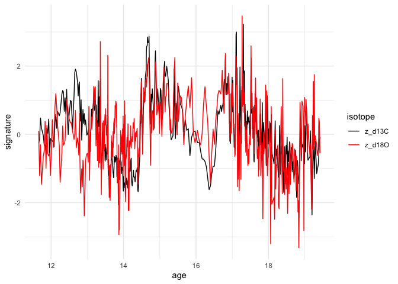
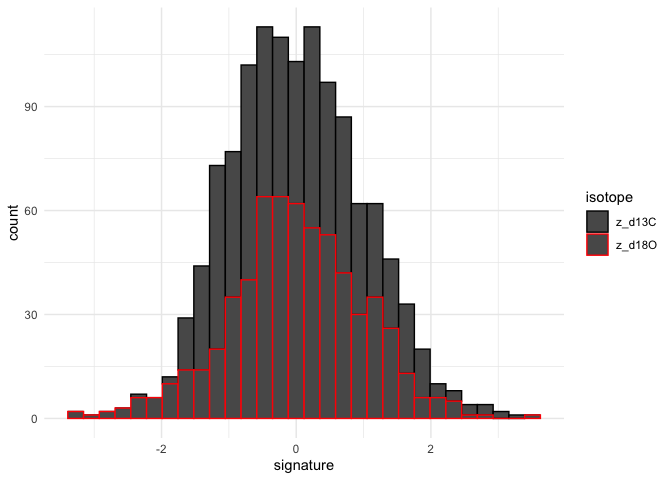

Hendy Test - R Notebook
================

This is an [R Markdown](http://rmarkdown.rstudio.com) Notebook. When you
execute code within the notebook, the results appear beneath the code.

Some basic information will appear when you create a new R Notebook in
the RStudio IDE (like the bit just above). I’ve left those in, and added
some of my own, including the comments from the raw R script.

Background: Like the python notebook, the R Notebook provides an
interactive view of your code, while also allowing you to easily publish
a report from it (basic instructions further below). I’ve also provided
the raw R Script (ending in .R), if you run the script directly in
RStudio, the output will appear in the ‘console’ and ‘plots’ windows.

The command ‘setwd’ tells R where to look for files. You could
alternatively just give R the full path for the file you want to import.
You’ll need to replace the XXXX with the directory where your data file
is stored.

You’ll have noticed already there are differences in the R command names
the standards for setting up the R environment (i.e., importing
packages). I’ve commented out the ‘install.packages’ line above, but you
can highlight that code and press ‘command+enter’ to run just the
highlighted code. You’ll only need to do this if the ‘library’ command
says the package is not installed. Tidyverse is a collection of
libraries that are very useful for data import, manipulation, export,
plotting and and other things (<https://www.tidyverse.org/>).

Try executing this chunk by clicking the *Run* button within the chunk
or by placing your cursor inside it and pressing *Cmd+Shift+Enter*.

``` r
# Script originally written by Barbara Wortham (unkown date)
# Data first published in: Oster et al. (2015) (DOI: https://doi.org/10.1016/j.quascirev.2015.07.027)
# Python script modified by Sophia Macarewich & ported to R by Will Matthaeus April 2022 for Montanez lab group 
#
# This script showcases:
# - Importing CSV file & extracting speleothem isotope timeseries
# - Plotting panels of histograms
# - Plotting panel of d18O and d13C timeseries
# - Testing d18O and d13C for Hendy test criteria #2
# Hendy Test Criteria 2: No simultaneous enrichments (aka correlation) of d18O and d13C speleothem calcite
# Dorale & Liu (2009)


#one nice thing about the RStudio IDE is that you can lookup functions easily, 
#and the IDE will try to autocomplete functions, paths and variables when you start typing their names.
#place your cursor next to 'setwd' and press F1. look in the bottom right window of the IDE
#the 'help' tab has opened, giving you infomration on the command
setwd("~/Dropbox/R_on_git/R_Speleothem")
#setwd("XXXX")#you will have to replace XXXX with the path to your file. try out autocomplete here. 
#start typing the name of the folder, press Tab, and the IDE will show you some options in a dropdown.
#install.packages("tidyverse") #highlight this command and run it if the next one tells you the package is not installed
library(tidyverse)
```

    ## ── Attaching packages ─────────────────────────────────────── tidyverse 1.3.0 ──

    ## ✓ ggplot2 3.3.5     ✓ purrr   0.3.4
    ## ✓ tibble  3.1.6     ✓ dplyr   1.0.8
    ## ✓ tidyr   1.2.0     ✓ stringr 1.4.0
    ## ✓ readr   1.4.0     ✓ forcats 0.5.1

    ## Warning: package 'tidyr' was built under R version 4.0.5

    ## Warning: package 'dplyr' was built under R version 4.0.5

    ## ── Conflicts ────────────────────────────────────────── tidyverse_conflicts() ──
    ## x dplyr::filter() masks stats::filter()
    ## x dplyr::lag()    masks stats::lag()

``` r
#install.packages("tidymodels")
library(tidymodels)
```

    ## Warning: package 'tidymodels' was built under R version 4.0.5

    ## ── Attaching packages ────────────────────────────────────── tidymodels 0.2.0 ──

    ## ✓ broom        0.8.0     ✓ rsample      0.1.1
    ## ✓ dials        0.1.1     ✓ tune         0.2.0
    ## ✓ infer        1.0.0     ✓ workflows    0.2.6
    ## ✓ modeldata    0.1.1     ✓ workflowsets 0.2.1
    ## ✓ parsnip      0.2.1     ✓ yardstick    0.0.9
    ## ✓ recipes      0.2.0

    ## Warning: package 'dials' was built under R version 4.0.5

    ## Warning: package 'parsnip' was built under R version 4.0.5

    ## Warning: package 'recipes' was built under R version 4.0.5

    ## Warning: package 'tune' was built under R version 4.0.5

    ## Warning: package 'workflows' was built under R version 4.0.5

    ## Warning: package 'workflowsets' was built under R version 4.0.5

    ## ── Conflicts ───────────────────────────────────────── tidymodels_conflicts() ──
    ## x scales::discard() masks purrr::discard()
    ## x dplyr::filter()   masks stats::filter()
    ## x recipes::fixed()  masks stringr::fixed()
    ## x dplyr::lag()      masks stats::lag()
    ## x yardstick::spec() masks readr::spec()
    ## x recipes::step()   masks stats::step()
    ## • Use suppressPackageStartupMessages() to eliminate package startup messages

``` r
#Read in data from delimited text file (i.e., csv)
dat<-read_csv("stable.csv") #read csv to tbl, also notice the assignment operator
```

    ## 
    ## ── Column specification ────────────────────────────────────────────────────────
    ## cols(
    ##   age = col_double(),
    ##   depth = col_double(),
    ##   d13C = col_double(),
    ##   d18O = col_double()
    ## )

``` r
mode(dat$age)#already in numeric vectors, notice column reference syntax
```

    ## [1] "numeric"

``` r
#Basic QC
unique(is.na(dat)) #check each column for missing values
```

    ##        age depth  d13C  d18O
    ## [1,] FALSE FALSE FALSE FALSE

``` r
print(dat) #print a preview of the tbl (behaves differently from print for dataframes)
```

    ## # A tibble: 617 × 4
    ##      age depth   d13C   d18O
    ##    <dbl> <dbl>  <dbl>  <dbl>
    ##  1  11.7  1.21 -10.6   -9.66
    ##  2  11.7  1.26 -10.4  -10.4 
    ##  3  11.7  1.30  -9.65  -9.90
    ##  4  11.7  1.35  -9.99 -10.6 
    ##  5  11.8  1.45 -10.2  -10.1 
    ##  6  11.8  1.49 -10.6  -10.0 
    ##  7  11.8  1.54 -10.5   -9.51
    ##  8  11.9  1.59 -10.8  -10.3 
    ##  9  11.9  1.64  -9.91  -9.57
    ## 10  11.9  1.68 -10.1  -10.1 
    ## # … with 607 more rows

Notice the syntax for storing a variable is ‘&lt;-’ rather than ‘=’,
which does something a little different in R.

Because I imported the data using tidyr’s read\_csv, it automatically
detected the data type in each column. It also detected the column
headers. These can both overridden and assigned manually. This means
that each column is already has a name, and is a numeric vector that can
be used in downstream computations. I checked this with the ‘mode’
command. Also notice that I used the ‘$’ operator to reference a named
column of the tbl.

It’s always a good idea to visually check the data structures (called a
tbl, tibble, or data frame in this case) after import to avoid
downstream errors, which can sometimes be a big nuisance. I’ve done two
quality checks here, looking for ‘NAs’ in the data, which are missing
values, and simply printing the data.

Exporatory Analysis: It is also a good idea to visually check your data
using some basic plots, like those below. Look out for any unexpected
values that might indicate data did not import correctly. Also, are the
data distributed in a way you would expect? Are they normally
distributed?

``` r
#Basic exploratory data anlysis and QC, these will just be output, and not saves
ggplot(data=dat)+geom_point(aes(x=d13C, y=d18O)) #make a scatterplot
```

<!-- -->

``` r
ggplot(data=dat)+geom_histogram(aes(x=d13C),bins = 50) #histogram of C
```

<!-- -->

``` r
ggplot(data=dat)+geom_histogram(aes(x=d18O), bins = 50) #histogram of O
```

<!-- --> Breaking
the time series down into time intervals can be done using higher level
(more developed) functions in R. This is effectively the same process as
‘binning’ data, as you would in making a histogram. R has a function
called ‘cut’ that does it automatically, or using custom interval breaks
and names. I’m doing this ahead of time to save us from repeating code
below, you’ll see why in a second.

``` r
#Define time intervals, and names. I'm taking a slightly different approach here.
#this part is the same
t_ints <- as.numeric(c(11.6, 12.7, 13.5, 14.5, 15.0, 16.2, 17.5, 20.0))
t_int_names <- c('Younger Dryas\n(11.6-12.7 ka)',
                'Allerod\n(12.7-13.5 ka)',
                'Older Dryas\n(13.5-14.5 ka)',
                'Bolling\n(14.5-15 ka)',
                'Big Wet\n(15-16.2 ka)',
                'Big Dry\n(16.2-17.5 ka)',
                'Last Glacial Maximum\n(17.5-20 ka)')
#now use cut to create a categorical variable that distinguishes the rows according to the intervals defined in 't_ints'
dat$interval<-cut(dat$age,breaks = t_ints, labels=t_int_names)
```

Now, lets plot each whole time series (raw observations) and save plot.
Note that there are plotting functions that come with base R (i.e., not
ggplot2) that function very much like those in python, but i’m going to
stick with ggplot2 as it requires a slightly different approach to
format the data correctly. Specifically we are going to reshape the data
so that each row represents an observation (rather than two observations
at the same depth). We’ll use ‘pivot\_longer’ from tidyr (a tidyverse
package). This ‘cheat sheet’ has some visual examples of pivot\_longer
and pivot\_wider
(<https://github.com/rstudio/cheatsheets/blob/main/tidyr.pdf>)

``` r
#Create and save figures of time series
#first 'lengthen' data
colnames(dat) #remind ourselves of the names so we can copy paste, and avoid errors
```

    ## [1] "age"      "depth"    "d13C"     "d18O"     "interval"

``` r
#Note i'm splitting this command onto multiple lines to improve readability, in R you can just split up 
#comma separated inputs (i.e., function(,,,,)) in this way.
dat_long <- pivot_longer(data=dat, 
                         cols=c( "d13C" , "d18O" ),
                         names_to = "isotope",
                         values_to = "signature"
                         ) 
#tell R that itnervals and isotopes should be treated separately
dat_long<-dat_long%>%group_by(interval, isotope)#note the new operater '%>%' which is equivalent to a pipe, 
#by passing the tbl to the standard input of the 'group_by' function
dat_long#take a look
```

    ## # A tibble: 1,234 × 5
    ## # Groups:   interval, isotope [14]
    ##      age depth interval                        isotope signature
    ##    <dbl> <dbl> <fct>                           <chr>       <dbl>
    ##  1  11.7  1.21 "Younger Dryas\n(11.6-12.7 ka)" d13C       -10.6 
    ##  2  11.7  1.21 "Younger Dryas\n(11.6-12.7 ka)" d18O        -9.66
    ##  3  11.7  1.26 "Younger Dryas\n(11.6-12.7 ka)" d13C       -10.4 
    ##  4  11.7  1.26 "Younger Dryas\n(11.6-12.7 ka)" d18O       -10.4 
    ##  5  11.7  1.30 "Younger Dryas\n(11.6-12.7 ka)" d13C        -9.65
    ##  6  11.7  1.30 "Younger Dryas\n(11.6-12.7 ka)" d18O        -9.90
    ##  7  11.7  1.35 "Younger Dryas\n(11.6-12.7 ka)" d13C        -9.99
    ##  8  11.7  1.35 "Younger Dryas\n(11.6-12.7 ka)" d18O       -10.6 
    ##  9  11.8  1.45 "Younger Dryas\n(11.6-12.7 ka)" d13C       -10.2 
    ## 10  11.8  1.45 "Younger Dryas\n(11.6-12.7 ka)" d18O       -10.1 
    ## # … with 1,224 more rows

``` r
#We can use the new variable 'isotope' in 'dat_long' to automatically group observations by isotope type
#an overview of ggplot2 usage can be found here, (https://github.com/rstudio/cheatsheets/blob/main/data-visualization-2.1.pdf)
#ggplot is a very useful tool for data visualization, and some analyses

ggplot(data = dat_long)+geom_line(aes(x=age, y=signature, color=isotope))+ 
  #you can also break up commands connected by '+' operators onto separate lines 
  facet_grid(isotope~.,scales = "free_y")+
  theme_minimal()
```

<!-- -->

``` r
#the 'ggplot' command sends output to the screen and not to a file, unless the output
#is saved (see below).
```

To save plots to a file, first store the plot in a variable ‘p’, and use
the separate command ‘ggsave’ to save graphics with screen- or
print-appropriate resolutions usually 300 dpi is a good start. You can
specify where the file should go by adding ‘path = /where/it/goes’as an
argument to ’ggsave’

Note I’ve added some ‘theme’ elements to update and hopefully improve
the axes, labels, colors and text size, though it’s still not
publication ready.

``` r
#store plot to variable, update formatting and save to file with defined size and resolution
p<-ggplot(data = dat_long)+geom_line(aes(x=age, y=signature, color=isotope))+
  facet_grid(isotope~.,scales = "free_y")+
  theme_minimal()+
  scale_color_manual(values=c("black","red"))+
  labs(x="Age (Ka)")+
  scale_y_continuous(position = "right")+
  theme(text= element_text(size=22),legend.position = 'none',
        strip.placement.y = "outside", strip.text.y = element_text(angle=45),
        axis.title.y = element_blank())
  

ggsave("rawIsotopeSignatures.png", plot = p, device = "png", 
       scale = 1, height = 5, width = 8, units = c("in"),
       dpi = 300, limitsize = TRUE)
```

We can also use ggplot to separate intervals into a grid and fit linear
(or other) models.. here are some examples.

``` r
#view linear models fit to each isotope dataset as a whole
ggplot(data = dat_long, aes(x=age, y=signature))+
  geom_point(aes(color=isotope),size=0.5)+
  geom_smooth(method = "lm", se=FALSE, color="black")+
  facet_grid(isotope~.,scales = "free_y")+
  theme_minimal()+
  scale_color_manual(values=c("black","red"))+
  theme(legend.position = 'none',axis.title.y = element_blank())
```

    ## `geom_smooth()` using formula 'y ~ x'

<!-- -->

``` r
#view linear models fit to each isotope dataset separately for each interval
#adding interval as grid dimension is interesting
#but it introduces labeling problems
#because there is less space for the age labels
#and because the interval names are long (this is why i added '\n' to them before)
#there's still one big problem here... maybe you can fix it
ggplot(data = dat_long, aes(x=age, y=signature))+
  geom_point(aes(color=isotope),size=0.5)+
  geom_smooth(method = "lm", se=FALSE, color="black")+
  facet_grid(isotope~interval,scales = "free" )+
  theme_minimal()+
  scale_color_manual(values=c("black","red"))+
  theme(legend.position = 'none',axis.title.y = element_blank(),
        text = element_text(size=15),
        axis.text.x = element_text(angle = 75),
        title = element_text(angle=75),
        strip.text.x = element_text(size =6))#
```

    ## `geom_smooth()` using formula 'y ~ x'

<!-- -->

``` r
pS <- ggplot(data = dat_long, aes(x=age, y=signature))+
  geom_smooth(method = "lm", se=FALSE, color="black")
```

Now let’s dive into the statistical analysis: detrend and calculate
correlation for whole time series.

``` r
#detrending the dataset, just use a linear model
t0 <- max(dat$age)  
dat$ky_t0<-dat$age-t0 #calculate a new time variable, thousands of years from start

p_d18O <- lm(data = dat, formula = d18O ~ ky_t0)   #fit linear model
#use 'augment' from package 'broom' to look at model fit to calculate fit values automatically
#which are stored in the new column .fitted by default
dat$fitted_d18O<-augment(p_d18O)$.fitted
dat$notrend_d18O<-dat$d18O-dat$fitted_d18O
#ggplot()+geom_line(data=dat, aes(x=age, y=notrend_d18O))  #centered on zero
sd_d18O<-sd(dat$notrend_d18O)
dat$z_d18O<-dat$notrend_d18O/sd_d18O
#ggplot()+geom_line(data=dat, aes(x=age, y=z_d18O)) #the units are now 1SD 

p_d13C <- lm(data = dat, formula = d13C ~ ky_t0) 
dat$fitted_d13C<-augment(p_d13C)$.fitted
dat$notrend_d13C<-dat$d13C-dat$fitted_d13C
#ggplot()+geom_line(data=dat, aes(x=age, y=notrend_d13C)) #centered on zero
sd_d13C<-sd(dat$notrend_d13C)
dat$z_d13C<-dat$notrend_d13C/sd_d13C
```

Let’s see if it made a difference by plotting the z-scores as a time
series and histograms.

``` r
#make long z-data to faclitate ploting
z_dat_long <- pivot_longer(data=dat, 
                         cols=c( "z_d13C", "z_d18O"  ),
                         names_to = "isotope",
                         values_to = "signature"
                         ) 
#since the units are now comparable, we can plot them on the same scale
#time series 
ggplot()+geom_line(data=z_dat_long, aes(x=age, y=signature,color=isotope))+
  theme_minimal()+scale_color_manual(values = c("black","red"))
```

<!-- -->

``` r
#histogram
ggplot()+geom_histogram(data=z_dat_long, aes(x=signature, color=isotope))+
    theme_minimal()+scale_color_manual(values = c("black","red"))
```

    ## `stat_bin()` using `bins = 30`. Pick better value with `binwidth`.

<!-- -->

Now to do it again but for each interval separately
